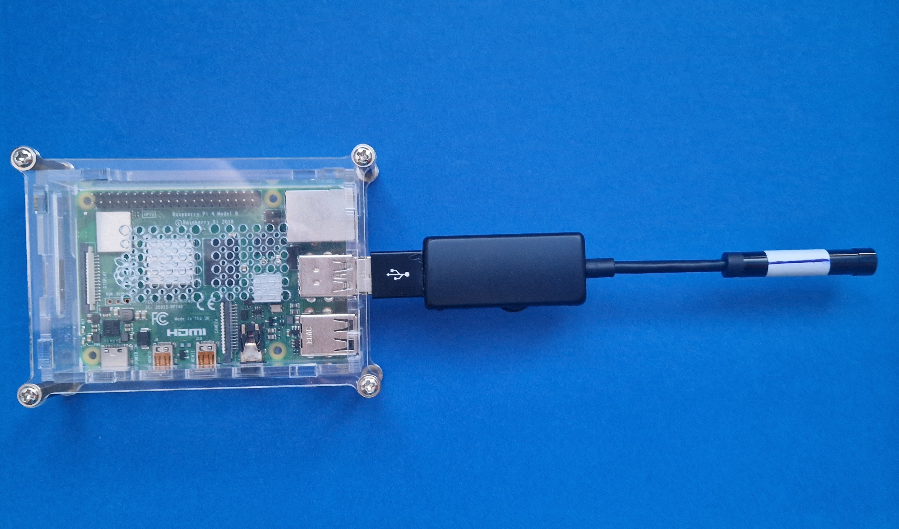

# Camera2Speech

A wearable Raspberry Pi based OCR-to-speech device inspired by OrCam MyEye 2.

## Goal

The goal of this project is to convert printed text into speech using a compact wearable setup.

Pipeline:

```text
Camera -> Image Processing -> OCR -> Text -> Speech -> Audio Output
```

Reference commercial product:

* OrCam MyEye 2

---

## Hardware

### Processing Unit

* Raspberry Pi 4

### Camera

* USB endoscope camera (reduced the cable length)
* Resolution: 1920x1080

### Audio Output

* Raspberry Pi audio jack (3.5 mm)

### Power

* Ultra Slim Magnet Powerbank
* Capacity: 5000 mAh
* Output: 5 V / 3 A

### Trigger

* Temporary: keyboard Enter key
* Planned: GPIO push-button

---

## Software

### Operating System

* Raspberry Pi OS

### Installed Packages

```bash
sudo apt install fswebcam
sudo apt install tesseract-ocr
sudo apt install tesseract-ocr-eng
sudo apt install tesseract-ocr-rus
sudo apt install rhvoice
sudo apt install rhvoice-russian
sudo apt install rhvoice-english
sudo apt install ffmpeg
sudo apt install openssh-server
```

---

## Processing Pipeline

```text
USB Camera
    ->
fswebcam
    ->
ffmpeg
    ->
tesseract
    ->
RHVoice
    ->
aplay
```

### Image Acquisition

```bash
fswebcam --no-banner img.jpg
```

### Image Preprocessing

Examples:

```bash
ffmpeg -y -i img.jpg -vf "format=gray,normalize" gray.jpg
```

or

```bash
ffmpeg -y -i img.jpg -vf "format=gray,histeq" gray.jpg
```

### OCR

```bash
tesseract gray.jpg output -l eng
```

### Text To Speech

```bash
cat output.txt | RHVoice-test -p alan
```

### Audio Playback

```bash
aplay -D hw:2,0
```

---

## camera2speech.sh

Current implementation:

* waits for user trigger
* captures image
* preprocesses image
* performs OCR
* converts text to speech
* plays speech through headphone jack

Future work:

* replace Enter key with GPIO push-button
* GPIO interrupt handling
* wearable enclosure
* power optimization

---

## System Configuration

### Console Mode

Disable desktop environment:

```bash
sudo systemctl set-default multi-user.target
```

Restore desktop:

```bash
sudo systemctl set-default graphical.target
```

### Automatic Login

Using:

```bash
sudo raspi-config
```

Select:

```text
System Options
-> Boot / Auto Login
-> Console Autologin
```

### Automatic Script Start

Add to:

```bash
~/.bash_profile
```

```bash
/home/brezhnyev/camera2speech.sh
```

The script starts automatically after boot.

---

## Audio Notes

The audio jack was detected as:

```text
Card 2: Headphones
```

Reliable playback:

```bash
aplay -D hw:2,0
```

This bypasses PipeWire/PulseAudio routing issues.

---

## Current Status

Working:

* USB camera capture
* Image preprocessing
* OCR
* Speech synthesis
* Audio playback
* SSH access
* Automatic startup
* Console-only operation

Planned:

* GPIO trigger
* Wearable enclosure
* Long-term battery testing
* Further OCR improvements

## camera2speech.sh

```bash
#!/bin/bash

while true; do
  read -n1 -p "Press Enter/key for shot..."

  fswebcam --no-banner img.jpg &&
  ffmpeg -y -i img.jpg -vf format=gray gray.jpg &&
  tesseract gray.jpg stdout -l rus+eng --psm 6 2>/dev/null |
  RHVoice-test -p anna -o - |
  ffmpeg -i pipe:0 -af "alimiter,volume=-3dB" -f wav - 2>/dev/null |
  aplay -D hw:2,0

done
```

